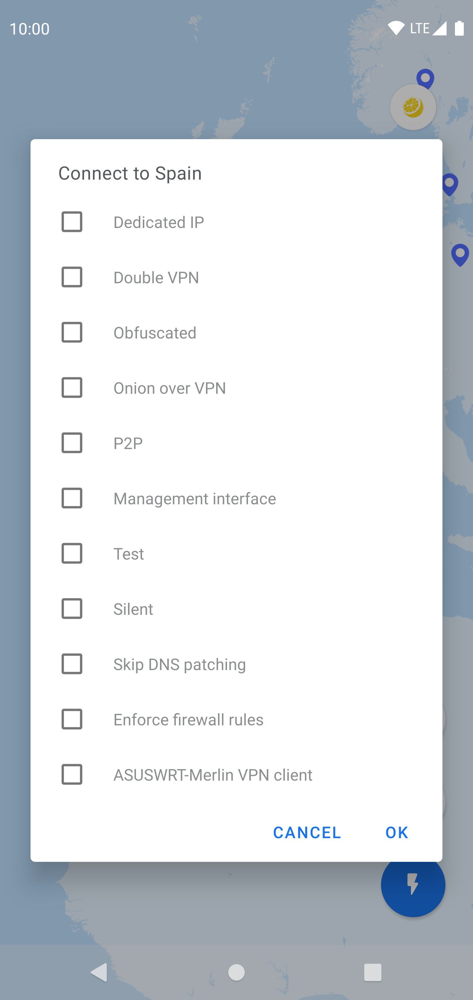
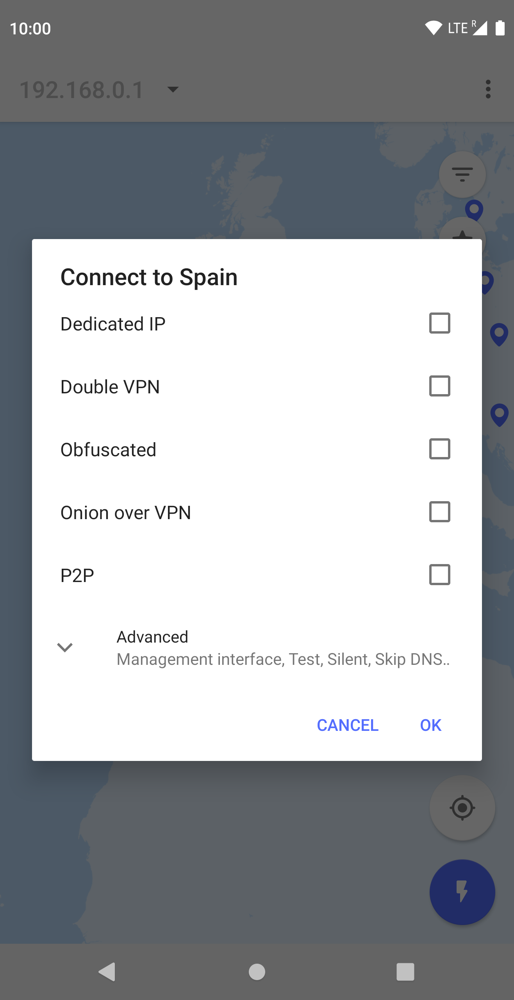
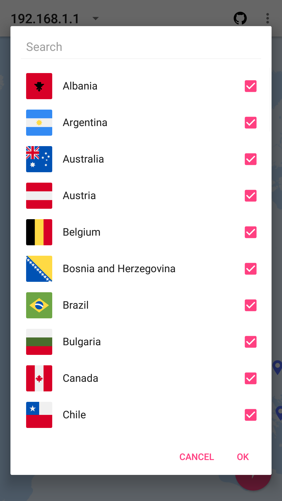
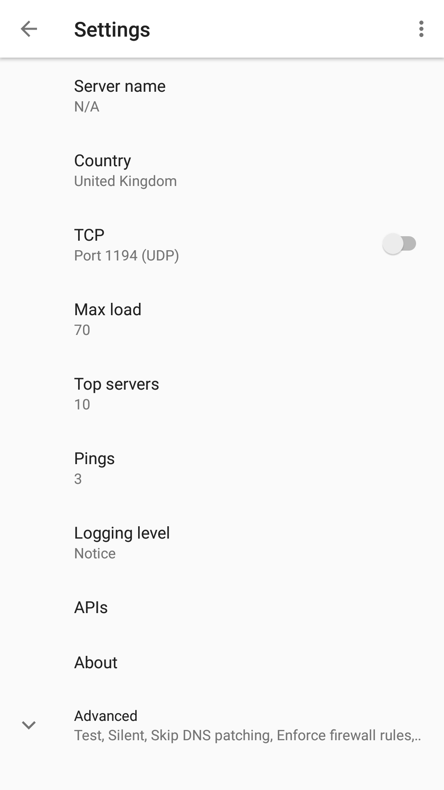
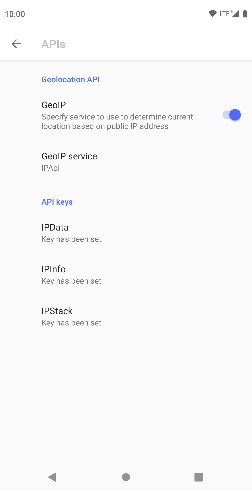

# openpyn-nordvpn-juiceSSH, a JuiceSSH plugin

An Android app written in C/C++, [Java](https://www.oracle.com/java/), and [Kotlin](https://kotlinlang.org/) to run [Openpyn](https://github.com/jotyGill/openpyn-nordvpn) remotely through JuiceSSH. Special thanks to [NvidiaGpuMonitor](https://github.com/sds100/NvidiaGpuMonitor), a JuiceSSH plugin written in Kotlin by [sds100](https://github.com/sds100) which served as a base for this JuiceSSH plugin.

> **Note**:
> The first public [beta](https://play.google.com/apps/testing/io.github.getsixtyfour.openpyn) has been released.

## Todo

-   [ ] add Telnet functionality for connecting to OpenVPN management interface
-   [ ] apply clean(er) app architecture

## Table of Contents

-   [Introduction](#introduction)
-   [Features](#features)
-   [How it works](#how-it-works)
-   [How to use](#how-to-use)
-   [Screenshots](#screenshots)
-   [Download](#download)
-   [Requirements](#requirements)
-   [References](#references)
-   [Libraries used](#libraries-used)
-   [Plugins used](#plugins-used)
-   [Feedback](#feedback)
-   [Credits](#credits)
-   [Built with](#built-with)
-   [Attributions](#attributions)
-   [Acknowledgments](#acknowledgments)

## Introduction

The idea all started when I wanted to connect to OpenVPN servers hosted by NordVPN on a [Asus RT-AC86U](https://www.asus.com/Networking/RT-AC86U/). By default this is possible, but the default firmware including third party firmware [Asuswrt-merlin](https://asuswrt.lostrealm.ca/) only allow for a maximum of 5 OpenVPN Clients to be saved.

I then stumbled on [Openpyn](https://github.com/jotyGill/openpyn-nordvpn), quickly learned Python, and made a pull request, enabling support for Asuswrt-merlin. Openpyn is a python3 script which can be run on [Entware-ng-3x on Asuswrt-merlin](https://gist.github.com/1951FDG/3cada1211df8a59a95a8a71db6310299#file-asuswrt-merlin-md). The main feature of Openpyn, is that it automatically connects to the least busy, lowest latency OpenVPN server. NVRAM write support for Asuswrt-merlin in Openpyn is then able to save the least busy, lowest latency OpenVPN server to the NVRAM of a Entware-ng-3x enabled ASUS router.

Now, I had achieved more or less what I desired, but this left me with one last struggle, having to resort to open a SSH connection to the ASUS router and supplying Openpyn with the desired arguments (e.g., country, server load threshold and server type). Having the ability to do that on a phone instead of a computer would make this a lot easier, and that led me to discovering [JuiceSSH](https://juicessh.com/).

JuiceSSH supports the use of plugins, which allowed me to create this fantastic app. This app runs on Android, it establishes a connection to a device that has a SSH server running on it, and it is then able to send a Openpyn command to the remote device.

> **Note**:
> This project is my very first Android project, and as such, it may not follow all the best coding practices yet, regardless of this, I'm committed to make this app a source of inspiration for other developers working on similar based Android apps, especially Google Maps based Android apps.

## Features

-   Supports most arguments available in Openpyn with easy to use preferences

-   Allows to use location based filtering in Openpyn

-   Map view displays markers for every country supported by NordVPN

-   Allows to hide countries in the map view

-   Allows to star a country in the map view

-   API keys stored in shared preferences are encrypted ("AES/GCM/NoPadding")

-   On app start, it will use a smart location, to determine the closest country

-   Uses Geolocation APIs to determine the current location based on the current public IP address
    -   <http://ip-api.com/>, <https://ipdata.co/>, <https://ipinfo.io/>, <https://ipstack.com/>

_Am I missing some essential feature?_

-   Submit an [issue](https://github.com/1951FDG/openpyn-nordvpn-juiceSSH/issues/new) and let's make this app better together!

## How it works

A lot of components make this app work, I'll cover some of the basics here. Basically on app startup, the map is loaded asynchronously, an MBTile file (SQLite database) located in the assets resource folder within the APK is loaded and then stored and read in memory. The [world.mbtiles](app/src/main/assets/world.mbtiles) was generated using a custom Python script, [generate_tiles_multiprocess.py](https://github.com/1951FDG/mapnik2mbtiles/blob/master/generate_tiles_multiprocess.py).

    rm ./app/src/main/assets/world.mbtiles
    python3 ./generate_tiles_multiprocess.py ./mapfile.xml ./app/src/main/assets/world.mbtiles 4 4 --format webp

After the map is done loading, the NordVPN API is invoked to query all the supported countries, filtering based on preferences such as server type is done here, markers are generated lazily for all the countries (markers are not placed on the map), all tiles (512x512 WebP images) are pre-loaded for the minimum zoom scale specified by the MBTile file. The current location is detected based on the public IP address of the client. The map then animates to the marker closest to this location. After animation completes, only the "lazy" markers whose location are within the visible bounds of the map are made visible (markers are placed on the map once they are made visible for the first time).

## How to use

-   Install [JuiceSSH](https://juicessh.com/)
-   Add a new connection to Connections in JuiceSSH
-   Install this app
-   When prompted, enable/allow the permissions required by this app
-   Change any app settings as required
-   Select a Country by selecting a marker on the map
-   Click the colored floating action button (FAB), to send a Openpyn command to the remote device

> **Note**:
> You can use this flow with multiple remote devices, as long as that remote device has a SSH server running on it and is configured in Connections in JuiceSSH and is selected in the app toolbar of this app before the colored floating action button (FAB) is clicked!

## Screenshots

## Download

The public [beta](https://play.google.com/apps/testing/io.github.getsixtyfour.openpyn) is open to anyone.

Please use my `test` branch of [Openpyn](https://github.com/1951FDG/openpyn-nordvpn).

    git clone --branch test git@github.com:1951FDG/openpyn-nordvpn.git
    cd openpyn-nordvpn
    pip3 install --upgrade .

## Requirements

To compile and run the project you'll need:

-   [Android Studio 3.5 or higher](https://developer.android.com/studio/)
    -   Android `10 (API level 29)`
    -   Android SDK Build-Tools `29.0.2`
    -   CMake `v3.10.2`
    -   Android SDK Platform-Tools
    -   Android SDK Tools
    -   NDK

-   Maps SDK for Android
    -   [Get API Key](https://developers.google.com/maps/documentation/android-sdk/signup)

## References

-   [MyStorage.kt](app/src/main/kotlin/io/github/getsixtyfour/openpyn/map/util/MyStorage.kt) inspired by blog post, [Save and retrieve ArrayList of Object in SharedPreference: Android](https://readyandroid.wordpress.com/save-and-retrieve-arraylist-of-object-in-sharedpreference-android/) from Ready Android.

-   [PrintArray.kt](app/src/main/kotlin/io/github/getsixtyfour/openpyn/utils/PrintArray.kt) inspired by Github repo, [PrintArray
    ](https://github.com/Tobibur/PrintArray) by Tobibur Rahman.

-   [SecurityManager.java](app/src/main/java/io/github/getsixtyfour/openpyn/security/SecurityCypher.java) inspired by blog post, [Making secured version of EditTextPreference](https://blog.nikitaog.me/2014/11/09/making-secured-edittextpreference/) by Nikita Ogorodnikov.
    -   [How to make the perfect Singleton? – Exploring Code – Medium](https://medium.com/exploring-code/how-to-make-the-perfect-singleton-de6b951dfdb0)
    -   [Basic Android Encryption Do’s and Don’ts – Vincent Huang – Medium](https://medium.com/@tiensinodev/basic-android-encryption-dos-and-don-ts-7bc2cd3335ff)
    -   [Android Security: Beware of the default IV! – Dorian Cussen – SystemDotRun](https://doridori.github.io/Android-Security-Beware-of-the-default-IV/)

## Libraries used

-   [AndroidX](https://developer.android.com/topic/libraries/support-library/androidx-rn)
-   [Anko](https://github.com/Kotlin/anko)
-   [Barista](https://github.com/SchibstedSpain/Barista)
-   [BlockCanary](https://github.com/1951FDG/AndroidPerformanceMonitor)
-   [countryboundaries](https://github.com/westnordost/countryboundaries)
-   [EasyPermissions](https://github.com/googlesamples/easypermissions)
-   [Fuel](https://github.com/kittinunf/Fuel)
-   [GDPRDialog](https://github.com/MFlisar/GDPRDialog)
-   [JuiceSSH Plugin Library](https://github.com/1951FDG/juicessh-pluginlibrary)
-   [Kotlin coroutines](https://github.com/Kotlin/kotlinx.coroutines)
-   [Kotlin](https://github.com/JetBrains/kotlin)
-   [Ktor](https://github.com/ktorio/ktor)
-   [LeakCanary](https://github.com/square/leakcanary)
-   [Minibar](https://github.com/mayuroks/minibar)
-   [Moshi](https://github.com/square/moshi)
-   [Moshi: Pristine Models](https://github.com/jayrave/moshi-pristine-models)
-   [MultiSelectDialog](https://github.com/1951FDG/Android-Multi-Select-Dialog)
-   [PreferenceActivityCompat](https://github.com/ohmae/preference-activity-compat)
-   [ProgressToolbar](https://github.com/1951FDG/ProgressToolbar)
-   [Result](https://github.com/kittinunf/Result)
-   [SLF4J](https://github.com/qos-ch/slf4j)
-   [SnackProgressBar](https://github.com/tingyik90/snackprogressbar)
-   [SQLite](https://github.com/requery/sqlite-android)
-   [StaticLog](https://github.com/jupf/staticlog)
-   [SVC](https://github.com/BansookNam/svc)
-   [Toasty](https://github.com/GrenderG/Toasty)

## Plugins used

-   [Detekt](https://github.com/arturbosch/detekt)
-   [Gradle Versions Plugin](https://github.com/ben-manes/gradle-versions-plugin)
-   [gradle-android-git-version](https://github.com/gladed/gradle-android-git-version)
-   [Unused Resources Remover for Android](https://github.com/konifar/gradle-unused-resources-remover-plugin)

## Feedback

Feel free to send us feedback by submitting an [issue](https://github.com/1951FDG/openpyn-nordvpn-juiceSSH/issues/new). Bug reports, feature requests, patches, and well-wishes are always welcome.

> **Note**:
> Pull requests are welcome. For major changes, please submit an issue first to discuss what you would like to change.

## Credits

This app uses (modified) code from several open source projects.

-   [About Box](https://github.com/eggheadgames/android-about-box)

-   [SQLite-NDK](https://github.com/KrystianBigaj/sqlite-ndk)
    -   Modified [sqlite3ndk.h](app/src/main/cpp/sqlite3ndk.h)
    -   Modified [sqlite3ndk.cpp](app/src/main/cpp/sqlite3ndk.cpp)

-   [Android Maps Extensions](https://github.com/mg6maciej/android-maps-extensions)
    -   Modified
        [LazyMarker.java](app/src/main/java/com/androidmapsextensions/lazy/LazyMarker.java)

-   [Map Utils](https://github.com/antoniocarlon/MapUtils)
    -   Modified [CameraUpdateAnimator.java](app/src/main/java/com/antoniocarlon/map/CameraUpdateAnimator.java)

-   [Google Maps Android API utility library](https://github.com/kiddouk/CheckableFloatingActionButton)
    -   [Point.java](app/src/main/java/com/google/maps/android/geometry/Point.java)
    -   [SphericalMercatorProjection.java](app/src/main/java/com/google/maps/android/projection/SphericalMercatorProjection.java)

-   [Checkable Floating Button](https://github.com/kiddouk/CheckableFloatingActionButton)
    -   Modified [CheckableFloatingActionButton.java](app/src/main/java/io/errorlab/widget/CheckableFloatingActionButton.java)
    -   Modified [CheckedSavedState.java](app/src/main/java/io/errorlab/widget/CheckedSavedState.java)

> **Note**:
> Special thanks to Yesy, author of [Read SQLite Database from Android Asset Resource](https://www.codeproject.com/Articles/1235533/Read-SQLite-Database-from-Android-Asset-Resource)

## Built with

-   [AX2J](http://ax2j.sickworm.com/)
-   [AdaptiveIconPlayground](https://github.com/nickbutcher/AdaptiveIconPlayground)
-   [Adobe Illustrator](https://www.adobe.com/products/illustrator.html)
-   [Android Studio](https://developer.android.com/studio/)
-   [Atom](https://atom.io/)
-   [Codacy](https://www.codacy.com/)
-   [DB Browser for SQLite](http://sqlitebrowser.org/)
-   [Dependabot](https://dependabot.com/)
-   [Fastlane](https://fastlane.tools/)
-   [Firebase Crashlytics](https://firebase.google.com/docs/crashlytics/)
-   [JSON Schema Tool](https://jsonschema.net/)
-   [Kotlin Code Sorter](https://github.com/longforus/KotlinCodeSorter)
-   [Maps SDK for Android](https://developers.google.com/maps/documentation/android-sdk/intro)
-   [Material Design Icons](https://materialdesignicons.com/)
-   [Mobile Export Script for Illustrator](https://github.com/1951FDG/mobile-export-scripts-illustrator)
-   [QuickDemo](https://github.com/PSPDFKit-labs/QuickDemo)
-   [Regex101](https://regex101.com/)
-   [Shape Shifter](https://beta.shapeshifter.design/)
-   [Snyk](https://snyk.io/)
-   [SonarLint](https://www.sonarlint.org/)
-   [Sourcetree](https://www.sourcetreeapp.com/)
-   [SVG-edit](https://svg-edit.github.io/svgedit/releases/latest/editor/svg-editor.html)
-   [TileMill](https://tilemill.s3.amazonaws.com/dev/TileMill-v0.10.1-291-g31027ed.zip)

## Attributions

-   [Natural Earth Map Data](https://www.naturalearthdata.com/downloads/10m-physical-vectors/)
-   [Country Flags Icons](https://www.flaticon.com/packs/countrys-flags)
-   [Global Logistics Icons](https://www.flaticon.com/packs/global-logistics-2)

## Acknowledgments

Many thanks to [Sonelli](https://github.com/Sonelli) who made this project possible and painless. Special thanks to [Krystian Bigaj](https://github.com/KrystianBigaj), author of [SQLite-NDK](https://github.com/KrystianBigaj/sqlite-ndk).
