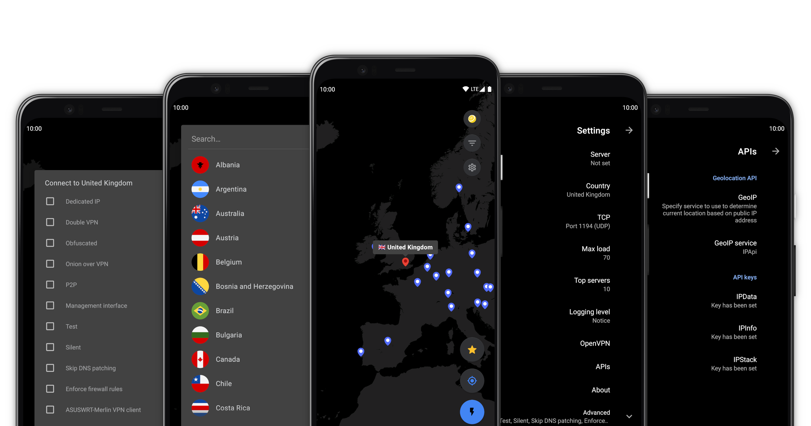

# openpyn-nordvpn-juiceSSH, a JuiceSSH plugin

[](LICENSE)
[](https://kotlinlang.org)
[](<>)
[](https://github.com/1951FDG/openpyn-nordvpn-juiceSSH/commits/master)
[](https://snyk.io/test/github/1951FDG/openpyn-nordvpn-juiceSSH?targetFile=app%2Fbuild.gradle)
[](https://www.codacy.com/app/1951FDG/openpyn-nordvpn-juiceSSH?utm_source=github.com&utm_medium=referral&utm_content=1951FDG/openpyn-nordvpn-juiceSSH&utm_campaign=Badge_Grade)
[](https://github.com/1951FDG/openpyn-nordvpn-juiceSSH/releases)

An Android app written in C/C++, Java, and Kotlin to run [Openpyn](https://github.com/jotyGill/openpyn-nordvpn) remotely through [JuiceSSH](https://juicessh.com).

> **Note**:
> The public [beta](https://play.google.com/apps/testing/io.github.getsixtyfour.openpyn) is now available on Google Play.



## Table of Contents

<details>
<summary>"Click to expand"</summary>

- [Introduction](#introduction)
- [Features](#features)
- [How it works](#how-it-works)
- [Prerequisites](#prerequisites)
- [Usage](#usage)
- [Requirements](#requirements)
- [Feedback](#feedback)
- [References](#references)
- [Built with](#built-with)
- [Attributions](#attributions)
- [Acknowledgments](#acknowledgments)

</details>

## Introduction

The idea started when I wanted to connect to OpenVPN servers hosted by NordVPN on a [Asus RT-AC86U](https://www.asus.com/Networking/RT-AC86U/). By default this is possible, but the default firmware including third party firmware [Asuswrt-merlin](https://asuswrt.lostrealm.ca) only allow for a maximum of 5 OpenVPN Clients to be saved.

I then stumbled on [Openpyn](https://github.com/jotyGill/openpyn-nordvpn), quickly learned Python, and made a pull request, enabling support for Asuswrt-merlin. Openpyn is a Python script which can be run on [Entware-ng-3x on Asuswrt-merlin](https://gist.github.com/1951FDG/3cada1211df8a59a95a8a71db6310299#file-asuswrt-merlin-md). The main feature of Openpyn, is that it automatically connects to the least busy, lowest latency OpenVPN server. NVRAM write support for Asuswrt-merlin in Openpyn is then able to save the least busy, lowest latency OpenVPN server to the NVRAM of a Entware-ng-3x enabled ASUS router.

Now, I had achieved more or less what I desired, but this left me with one last struggle, having to resort to open a SSH connection to the ASUS router and supplying Openpyn with the desired arguments (e.g., country, server load threshold and server type). Having the ability to do that on a phone instead of a computer would make this a lot easier, and that led me to discovering [JuiceSSH](https://juicessh.com).

JuiceSSH supports the use of plugins, which allowed me to create this fantastic app. This app runs on Android, it establishes a connection to a device that has a SSH server running on it, and it is then able to run Openpyn on the remote device.

> **Note**:
> This project is my very first Android project, and as such, it may not follow all the best coding practices yet, regardless of this, I'm committed to make this app a source of inspiration for other developers working on similar based Android apps, especially Google Maps based Android apps.

## Features

- Telnet functionality for connecting to OpenVPN management interface

- Supports most arguments available in Openpyn

- Allows to use location based filtering in Openpyn

- Map view displays markers for every country supported by NordVPN

- Allows to hide countries in the map view

- Allows to star a country in the map view

- API keys stored in shared preferences are encrypted

- On app start, it will use a smart location, to determine the closest country

- Uses Geolocation APIs to determine the current location based on the current public IP address
  - <http://ip-api.com>, <https://ipdata.co>, <https://ipinfo.io>, <https://ipstack.com>

> **Note**:
> *Am I missing some essential feature?* Submit an [issue](https://github.com/1951FDG/openpyn-nordvpn-juiceSSH/issues/new) and let's make this app better together!

## How it works

A lot of components make this app work, I'll cover some of the basics here.

On app startup, the map is loaded asynchronously, an MBTile file (SQLite database) located in the assets resource folder within the APK is loaded and then stored and read in memory.

After the map is done loading, "lazy" markers are generated for all the available countries (markers are not placed on the map), all tiles (512x512 WebP images) are pre-loaded for the zoom scale specified by the MBTile file.

The current location is detected based on the public IP address of the client. The map then animates to the marker closest to this location.

After animation completes, the "lazy" markers whose location are within the visible bounds of the map are made visible (markers are placed on the map once they are made visible for the first time).

The [world.mbtiles](app/src/main/assets/world.mbtiles) was generated using a Python script, [generate_tiles_multiprocess.py](https://github.com/1951FDG/mapnik2mbtiles/blob/master/generate_tiles_multiprocess.py).

## Prerequisites

Please use my `test` branch of [Openpyn](https://github.com/1951FDG/openpyn-nordvpn).

```sh
git clone --branch test git@github.com:1951FDG/openpyn-nordvpn.git
cd openpyn-nordvpn
pip3 install --upgrade .
```

## Usage

- Install [JuiceSSH](https://juicessh.com)
- Add a new connection to Connections in JuiceSSH
- Install the public [beta](https://play.google.com/apps/testing/io.github.getsixtyfour.openpyn)
- When prompted, enable/allow the permissions required by this app
- Change any app settings as required
- Select a Country by selecting a marker on the map
- Click the connect floating action button (FAB), to run Openpyn on the remote device

> **Note**:
> You can use this flow with multiple remote devices, as long as that remote device has a SSH server running on it and is configured in Connections in JuiceSSH and the connection is selected in this app before the connect FAB is clicked!

## Requirements

To compile and run the project you'll need:

- Android Studio 4.1.2 or higher
  - Android SDK Platform `30`
  - Android SDK Build-Tools `30.0.3`
  - CMake `v3.10.2`
  - NDK `21.4.7075529`

- Maps SDK for Android
  - [Get an API key](https://developers.google.com/maps/documentation/android-sdk/signup)

## Feedback

Feel free to send us feedback by submitting an [issue](https://github.com/1951FDG/openpyn-nordvpn-juiceSSH/issues/new). Bug reports, feature requests, patches, and well-wishes are always welcome.

> **Note**:
> Pull requests are welcome. For major changes, please submit an issue first to discuss what you would like to change.

## References

- [SecuredEditTextPreference.java](app/src/main/java/io/github/getsixtyfour/openpyn/security/SecuredEditTextPreference.java)
  - [Making secured version of EditTextPreference](https://blog.nikitaog.me/2014/11/09/making-secured-edittextpreference/)

- [SecurityCypher.java](app/src/main/java/io/github/getsixtyfour/openpyn/security/SecurityCypher.java)
  - [Android Security: Beware of the default IV! – Dorian Cussen – SystemDotRun](https://doridori.github.io/Android-Security-Beware-of-the-default-IV/)
  - [Basic Android Encryption Do’s and Don’ts – Vincent Huang – Medium](https://medium.com/@tiensinodev/basic-android-encryption-dos-and-don-ts-7bc2cd3335ff)
  - [How to make the perfect Singleton? – Exploring Code – Medium](https://medium.com/exploring-code/how-to-make-the-perfect-singleton-de6b951dfdb0)

## Built with

<details>
<summary>Libraries</summary>

- [AboutBox](https://github.com/eggheadgames/android-about-box)
- [Barista](https://github.com/SchibstedSpain/Barista)
- [BlockCanary](https://github.com/1951FDG/AndroidPerformanceMonitor)
- [EasyPermissions](https://github.com/googlesamples/easypermissions)
- [JuiceSSH Plugin](https://github.com/1951FDG/juicessh-pluginlibrary)
- [Kotlin](https://github.com/JetBrains/kotlin)
- [Kotlin Coroutines](https://github.com/Kotlin/kotlinx.coroutines)
- [Kotlin Logging](https://github.com/MicroUtils/kotlin-logging)
- [Ktor](https://github.com/ktorio/ktor)
- [LeakCanary](https://github.com/square/leakcanary)
- [Moshi](https://github.com/square/moshi)
- [PreferenceActivityCompat](https://github.com/ohmae/preference-activity-compat)
- [ProgressToolbar](https://github.com/1951FDG/ProgressToolbar)
- [SLF4J](https://github.com/qos-ch/slf4j)
- [SQLite](https://github.com/requery/sqlite-android)
- [SVC](https://github.com/BansookNam/svc)

</details>

<details>
<summary>Plugins</summary>

- [Android Git Version](https://github.com/gladed/gradle-android-git-version)
- [Click Debounce](https://github.com/SmartDengg/click-debounce)
- [Detekt](https://github.com/arturbosch/detekt)
- [Dexcount](https://github.com/KeepSafe/dexcount-gradle-plugin)
- [Error Prone](https://github.com/tbroyer/gradle-errorprone-plugin)
- [Git Properties](https://github.com/n0mer/gradle-git-properties)
- [Google Play Services](https://github.com/google/play-services-plugins)
- [Unused Resources Remover](https://github.com/konifar/gradle-unused-resources-remover-plugin)
- [Versions](https://github.com/ben-manes/gradle-versions-plugin)

</details>

<details>
<summary>Tools</summary>

- [AdaptiveIconPlayground](https://github.com/nickbutcher/AdaptiveIconPlayground)
- [Adobe Illustrator](https://www.adobe.com/products/illustrator.html)
- [Atom](https://atom.io)
- [DB Browser for SQLite](https://sqlitebrowser.org)
- [Fastlane](https://fastlane.tools)
- [Gimp](https://www.gimp.org/)
- [JSON Schema Tool](https://jsonschema.net)
- [Material Design Icons](https://materialdesignicons.com)
- [Meld](https://meldmerge.org)
- [QuickDemo](https://github.com/PSPDFKit-labs/QuickDemo)
- [Regex101](https://regex101.com)
- [Shape Shifter](https://beta.shapeshifter.design)
- [Sourcetree](https://www.sourcetreeapp.com)
- [SVG-edit](https://github.com/SVG-Edit/svgedit)

</details>

<details>
<summary>Scripts</summary>

- [Mapnik to MBTiles](https://github.com/1951FDG/mapnik2mbtiles)
- [Mobile Export Script for Illustrator](https://github.com/1951FDG/mobile-export-scripts-illustrator)
- [Vector Drawable Resource Directory to Color Resource File](https://github.com/1951FDG/vectordrawableresdir2colorresfile)

</details>

## Attributions

- [Business Icons](https://www.flaticon.com/packs/business-14)
- [Country Flags Icons](https://www.flaticon.com/packs/countrys-flags)
- [Natural Earth Map Data](https://www.naturalearthdata.com/downloads/10m-physical-vectors/)

## Acknowledgments

- [Krystian Bigaj](https://github.com/KrystianBigaj), author of [SQLite-NDK](https://github.com/KrystianBigaj/sqlite-ndk).
- [sds100](https://github.com/sds100), author of [NvidiaGpuMonitor](https://github.com/sds100/NvidiaGpuMonitor).
- [Sonelli](https://github.com/Sonelli), author of [JuiceSSH](https://juicessh.com).

> **Note**:
> Special thanks to Yesy, author of [Read SQLite Database from Android Asset Resource](https://www.codeproject.com/Articles/1235533/Read-SQLite-Database-from-Android-Asset-Resource)
